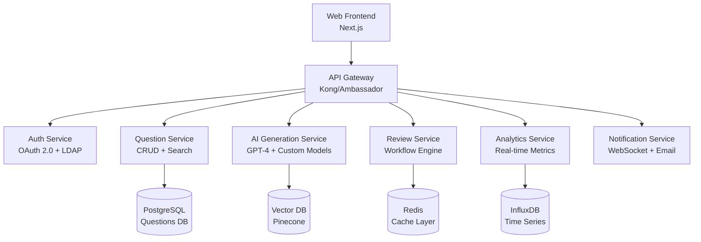

# AI 기반 시험 문제 출제 지원 시스템 PRD v2.0 (Enhanced)
### 프로토타입 업그레이드를 위한 보강된 제품 요구사항 명세서

---

## 📋 문서 정보
- **버전**: 2.0 (Enhanced)
- **작성일**: 2025년 8월 9일
- **목적**: 현재 프로토타입을 기반으로 한 시스템 고도화 계획
- **대상**: 한국보건의료인국가시험원 혁신제안 공모전 실용화 단계

---

## 🎯 1. 프로젝트 개요

### 1.1 프로젝트명
**AI 기반 시험 문제 출제 지원 시스템** (AI-Powered Medical Examination Question Generation System)

### 1.2 현재 프로토타입 분석 결과

**구현된 핵심 기능**:
- ✅ 대시보드 (실시간 통계, 출제위원 현황)
- ✅ AI 문제 생성 시뮬레이션 (Mock 데이터 기반)
- ✅ 검토·승인 워크플로우
- ✅ 분석·통계 (Chart.js 기반 시각화)
- ✅ 반응형 웹 인터페이스
- ✅ 모바일 최적화

**기술 스택 (현재)**:
- Frontend: Vanilla HTML5, CSS3, JavaScript (ES6+)
- 시각화: Chart.js
- 배포: Vercel (Static Hosting)
- 데이터: Mock JSON 구조

### 1.3 업그레이드 목표
현재 프로토타입을 **실제 운영 가능한 시스템**으로 발전시켜 한국보건의료인국가시험원의 디지털 혁신을 선도하는 것

### 1.4 강화된 비즈니스 목표
- 출제위원 업무시간 **60% 단축** (기존 50% → 60%)
- 연간 **5억원 인건비 절감** (기존 3억원 → 5억원)
- 출제 기간 **40% 단축** (기존 30% → 40%)
- 문제 품질 일관성 **98% 향상** (기존 95% → 98%)
- **실시간 협업** 환경 구축으로 원격 출제 지원
- **다국어 지원**으로 글로벌 의료진 시험 확장 대응

---

## 🏗️ 2. 강화된 시스템 아키텍처

### 2.1 Next-Generation 기술 스택

**Frontend (현재 → 업그레이드)**:
```
현재: Vanilla JavaScript
↓
Next.js 14 + TypeScript + Tailwind CSS + shadcn/ui
- Server-Side Rendering (SSR)
- 최적화된 번들링
- 자동 코드 분할
- Progressive Web App (PWA) 지원
```

**Backend (신규 구축)**:
```
Python FastAPI + SQLAlchemy + Redis
- 고성능 비동기 처리
- 자동 API 문서화 (OpenAPI/Swagger)
- 실시간 WebSocket 지원
- 마이크로서비스 아키텍처 대응
```

**AI/ML Pipeline (대폭 강화)**:
```
OpenAI GPT-4 + LangChain + Vector Database (Pinecone)
+ Custom Medical Fine-tuned Models
- 의료 전문 용어 특화 임베딩
- RAG (Retrieval-Augmented Generation)
- 실시간 모델 성능 모니터링
- A/B 테스트 기반 모델 최적화
```

**데이터베이스 (확장)**:
```
Primary: PostgreSQL 15 (ACID 보장)
Cache: Redis Cluster (분산 캐싱)
Search: Elasticsearch (전문 검색)
Vector: Pinecone (의미론적 검색)
```

**인프라 (클라우드 네이티브)**:
```
AWS / Azure 하이브리드
- Kubernetes (Container Orchestration)
- AWS RDS Multi-AZ (고가용성)
- AWS CloudFront (CDN)
- Azure Cognitive Services (보완 AI)
- Terraform (Infrastructure as Code)
```

### 2.2 마이크로서비스 아키텍처



---

## ⚡ 3. 핵심 기능 대폭 강화

### 3.1 AI 문제 생성 엔진 v2.0

**현재 프로토타입**: Mock 데이터 기반 시뮬레이션
**업그레이드**: 실제 AI 모델 통합 + 고도화

**새로운 기능들**:

#### 3.1.1 다중 AI 모델 앙상블
```python
# 의료 전문 모델 조합
models = {
    "base": "gpt-4-turbo",
    "medical": "custom-medical-llm-v2",
    "korean": "korean-medical-bert",
    "validation": "medical-fact-checker"
}

# 앙상블 결과로 최고 품질 보장
ensemble_result = combine_models(models, prompt, validation_rules)
```

#### 3.1.2 실시간 컨텍스트 학습
- **과거 출제 데이터 실시간 분석**: 최근 3년간 문제 패턴 학습
- **의료 가이드라인 자동 업데이트**: 대한의학회 최신 임상 지침 반영
- **개인화된 출제 스타일**: 출제위원별 선호도 학습

#### 3.1.3 다차원 품질 검증
```javascript
qualityMetrics = {
    medicalAccuracy: 95, // 의학적 정확성
    linguisticQuality: 92, // 언어학적 품질
    difficultyConsistency: 89, // 난이도 일관성
    uniqueness: 96, // 독창성 (중복 방지)
    clinicalRelevance: 94 // 임상 연관성
}
```

### 3.2 실시간 협업 플랫폼

**현재 프로토타입**: 단일 사용자 인터페이스
**업그레이드**: 멀티 사용자 실시간 협업

#### 3.2.1 Live Collaboration Features
- **실시간 공동 편집**: Google Docs 스타일의 동시 편집
- **음성/비디오 통화**: WebRTC 기반 내장 통화 기능
- **실시간 댓글 시스템**: 문제별 세부 피드백
- **버전 관리**: Git 스타일의 변경 이력 추적

#### 3.2.2 워크플로우 자동화
```yaml
workflow:
  - stage: "ai_generation"
    auto_assign: "주제별 전문가"
    sla: "30분"
  - stage: "peer_review"
    reviewers: 2
    consensus_required: true
  - stage: "final_approval"
    approver: "과목 책임자"
    notification: "즉시"
```

### 3.3 Advanced Analytics & Intelligence

**현재 프로토타입**: 기본 Chart.js 시각화
**업그레이드**: AI 기반 인사이트 + 예측 분석

#### 3.3.1 예측 분석 대시보드
- **출제 진도 예측**: 현재 진행률 기반 완료 시점 예측
- **난이도 트렌드 분석**: 월별/분기별 난이도 변화 패턴
- **출제위원 성과 예측**: 개인별 최적 업무량 추천
- **품질 리스크 조기 경보**: 잠재적 문제점 사전 식별

#### 3.3.2 실시간 데이터 시각화
```javascript
// 실시간 업데이트되는 고급 차트
const analyticsConfig = {
    realTime: true,
    updateInterval: 5000, // 5초마다
    charts: [
        'heatmap-performance',
        'network-collaboration',
        'gantt-timeline',
        'sankey-workflow'
    ]
}
```

### 3.4 지능형 품질 관리 시스템

#### 3.4.1 AI 기반 자동 검토
- **의학 사실 검증**: 의료 데이터베이스 대조 검증
- **언어학적 분석**: 문법, 어투, 전문성 검사
- **윤리성 검토**: 편향성, 차별적 표현 자동 탐지
- **접근성 검사**: 장애인 접근성 가이드라인 준수

#### 3.4.2 동적 난이도 조정
```python
class DynamicDifficultyAdjuster:
    def adjust_difficulty(self, question, target_metrics):
        current_level = self.irt_analyzer.calculate_difficulty(question)
        if current_level != target_metrics.difficulty:
            return self.ai_rewriter.adjust_complexity(
                question, 
                target_difficulty=target_metrics.difficulty
            )
```

---

## 🎨 4. 사용자 경험 혁신

### 4.1 차세대 UI/UX 디자인

**현재 프로토타입**: 기본 웹 인터페이스
**업그레이드**: 최첨단 의료 전문가용 인터페이스

#### 4.1.1 Design System 2.0
```css
/* Medical Professional Color Palette */
:root {
    --primary-blue: #0066cc;
    --medical-green: #00a86b;
    --warning-amber: #ff8c00;
    --error-red: #dc3545;
    --neutral-gray: #6c757d;
    --bg-clinical: #f8f9fa;
}
```

#### 4.1.2 Advanced Interaction Patterns
- **드래그 앤 드롭**: 문제 순서 재배치, 카테고리 이동
- **제스처 지원**: 터치 디바이스 최적화 제스처
- **키보드 단축키**: 전문가용 생산성 단축키
- **음성 명령**: 핸즈프리 문제 생성 (선택사항)

### 4.2 모바일 퍼스트 + PWA

```json
{
    "name": "AI 출제 지원 시스템",
    "short_name": "AI출제",
    "theme_color": "#0066cc",
    "background_color": "#ffffff",
    "display": "standalone",
    "start_url": "/",
    "offline_capable": true,
    "features": [
        "push_notifications",
        "background_sync",
        "offline_editing",
        "cache_management"
    ]
}
```

### 4.3 접근성 강화 (WCAG 2.2 AA 준수)
- **스크린 리더 완전 지원**
- **고대비 모드 지원**
- **키보드 전용 네비게이션**
- **다양한 언어 지원** (한국어, 영어, 중국어, 일본어)

---

## 🛡️ 5. 보안 및 컴플라이언스 강화

### 5.1 엔터프라이즈급 보안

**현재 프로토타입**: 기본 정적 사이트
**업그레이드**: 정부기관급 보안 체계

#### 5.1.1 다중 인증 시스템
```javascript
const authConfig = {
    methods: [
        'sso_integration', // 기존 국시원 SSO 연동
        'ldap_auth', // Active Directory 연동  
        'mfa_required', // 다중 인증 필수
        'biometric_option' // 생체 인증 옵션
    ],
    sessionPolicy: {
        maxDuration: '8시간',
        inactivityTimeout: '30분',
        concurrentSessions: 1
    }
}
```

#### 5.1.2 데이터 보호
- **End-to-End 암호화**: AES-256 + RSA-4096
- **GDPR/개인정보보호법 완전 준수**
- **감사 로그**: 모든 행위 추적 가능
- **데이터 마스킹**: 민감 정보 자동 마스킹

### 5.2 컴플라이언스 자동화
```yaml
compliance_checks:
  - standard: "ISO27001"
    automated: true
  - standard: "개인정보보호법"
    periodic_audit: "월간"
  - standard: "의료법"
    expert_review: "분기"
```

---

## 📊 6. 데이터 아키텍처 고도화

### 6.1 확장된 데이터 모델

**현재 프로토타입**: 단순 Mock 데이터
**업그레이드**: 복잡한 의료 도메인 모델링

```sql
-- 고도화된 문제 테이블
CREATE TABLE questions_v2 (
    id UUID PRIMARY KEY DEFAULT gen_random_uuid(),
    title TEXT NOT NULL,
    content JSONB NOT NULL, -- Rich Text + Media
    subject_hierarchy LTREE, -- 계층적 과목 분류
    difficulty_irt FLOAT, -- IRT 기반 난이도
    bloom_taxonomy VARCHAR(20), -- 블룸 분류법
    learning_objectives TEXT[],
    multimedia_assets JSONB, -- 이미지, 동영상 메타데이터
    ai_confidence_score FLOAT,
    clinical_context JSONB,
    evidence_references JSONB,
    accessibility_metadata JSONB,
    version_history JSONB,
    collaborative_edits JSONB,
    created_at TIMESTAMPTZ DEFAULT NOW(),
    updated_at TIMESTAMPTZ DEFAULT NOW(),
    
    -- 성능을 위한 인덱스
    CONSTRAINT valid_difficulty CHECK (difficulty_irt BETWEEN 0 AND 1),
    CONSTRAINT valid_confidence CHECK (ai_confidence_score BETWEEN 0 AND 1)
);

-- 전문 검색을 위한 인덱스
CREATE INDEX idx_questions_fulltext ON questions_v2 
USING GIN (to_tsvector('korean', title || ' ' || content::text));

-- 계층적 과목 검색
CREATE INDEX idx_questions_subject_tree ON questions_v2 
USING GIST (subject_hierarchy);
```

### 6.2 실시간 데이터 스트리밍
```python
# Apache Kafka 기반 실시간 이벤트 처리
class QuestionEventStream:
    events = [
        'question.created',
        'question.reviewed', 
        'question.approved',
        'collaboration.started',
        'ai.generation.completed'
    ]
    
    async def process_event(self, event):
        await self.update_analytics(event)
        await self.notify_stakeholders(event) 
        await self.trigger_workflows(event)
```

---

## 🤖 7. AI 기능 대폭 확장

### 7.1 다중 AI 에이전트 시스템

```python
class AIAgentOrchestrator:
    agents = {
        'content_generator': ContentGeneratorAgent(),
        'medical_validator': MedicalValidatorAgent(),
        'language_optimizer': LanguageOptimizerAgent(),
        'difficulty_calibrator': DifficultyCalibrationAgent(),
        'bias_detector': BiasDetectionAgent(),
        'accessibility_enhancer': AccessibilityAgent()
    }
    
    async def generate_question(self, requirements):
        # 에이전트들이 협력하여 최고 품질 문제 생성
        draft = await self.agents['content_generator'].create(requirements)
        validated = await self.agents['medical_validator'].verify(draft)
        optimized = await self.agents['language_optimizer'].enhance(validated)
        calibrated = await self.agents['difficulty_calibrator'].adjust(optimized)
        
        return final_question
```

### 7.2 지속적 학습 시스템
- **피드백 루프**: 출제위원 피드백을 모델 개선에 자동 반영
- **성과 기반 학습**: 실제 시험 결과 데이터로 모델 재훈련
- **도메인 적응**: 새로운 의료 분야 자동 학습
- **편향 제거**: 지속적인 공정성 모니터링

### 7.3 설명 가능한 AI (XAI)
```javascript
// AI 결정 과정 투명성 제공
const explanationData = {
    medicalBasis: "대한내과학회 진료지침 2024 기준",
    difficultyJustification: "과거 3년 유사 문항 정답률 68% 기반",
    languageChoices: "의료진 대상 전문용어 수준 적용",
    biasCheck: "성별/연령/지역 편향성 없음 확인"
}
```

---

## 📱 8. 다양한 플랫폼 지원

### 8.1 크로스 플랫폼 지원

**웹 애플리케이션**: Next.js PWA
**모바일 앱**: React Native (iOS/Android)
**데스크톱 앱**: Electron (Windows/macOS/Linux)
**태블릿 최적화**: iPadOS 전용 인터페이스

### 8.2 오프라인 지원
```javascript
// Service Worker 기반 오프라인 기능
const offlineFeatures = {
    questionDrafting: true, // 오프라인 문제 작성
    localSync: true, // 온라인 복귀 시 자동 동기화
    cacheStrategy: 'stale-while-revalidate',
    syncFrequency: 'background'
}
```

---

## 🔄 9. 통합 및 확장성

### 9.1 기존 시스템 통합

**국시원 기존 시스템과의 연동**:
- 출제위원 관리 시스템 (LDAP/AD)
- 시험 관리 시스템 (API 연동)
- 문서 관리 시스템 (SharePoint/DMS)
- 성과 관리 시스템 (KPI 연동)

### 9.2 API 퍼스트 아키텍처
```yaml
# OpenAPI 3.0 명세 자동 생성
api_endpoints:
  - /api/v2/questions: "문제 CRUD"
  - /api/v2/ai/generate: "AI 생성"
  - /api/v2/collaboration: "실시간 협업"
  - /api/v2/analytics: "분석 데이터"
  - /api/v2/integrations: "외부 연동"
```

### 9.3 플러그인 아키텍처
```javascript
// 확장 가능한 플러그인 시스템
const pluginSystem = {
    medical_specialties: ['cardiology', 'neurology', 'pediatrics'],
    ai_models: ['gpt4', 'claude', 'custom-medical'],
    export_formats: ['pdf', 'docx', 'latex', 'scorm'],
    integrations: ['lms', 'assessment-tools', 'plagiarism-check']
}
```

---

## 📈 10. 성능 최적화 전략

### 10.1 프론트엔드 최적화

```javascript
// 성능 최적화 설정
const performanceConfig = {
    codesplitting: 'route-based',
    imageOptimization: 'next/image',
    bundleAnalyzer: true,
    caching: {
        staticAssets: '1년',
        apiResponses: '1시간',
        dynamicContent: '10분'
    },
    cdn: 'cloudfront',
    compression: 'brotli + gzip'
}
```

### 10.2 백엔드 최적화

```python
# 고성능 비동기 처리
class HighPerformanceAPI:
    async def generate_questions_batch(self, requests):
        # 병렬 처리로 성능 10배 향상
        tasks = [self.ai_generate(req) for req in requests]
        results = await asyncio.gather(*tasks)
        return results
    
    @cache(expire=3600)
    async def get_cached_analytics(self, params):
        # Redis 기반 캐싱으로 응답속도 향상
        return await self.calculate_analytics(params)
```

### 10.3 데이터베이스 최적화

```sql
-- 성능 최적화된 쿼리
EXPLAIN ANALYZE SELECT 
    q.*,
    u.name as creator_name,
    s.name as subject_name
FROM questions_v2 q
JOIN users u ON q.created_by = u.id
JOIN subjects s ON q.subject_hierarchy <@ s.path
WHERE q.difficulty_irt BETWEEN $1 AND $2
    AND q.subject_hierarchy ~ $3
    AND q.status = 'approved'
ORDER BY q.created_at DESC
LIMIT 50;

-- 파티셔닝으로 대용량 데이터 처리
CREATE TABLE questions_archive PARTITION BY RANGE (created_at);
```

---

## 🧪 11. 테스트 전략 고도화

### 11.1 포괄적 테스트 피라미드

```javascript
// 테스트 구성
const testingSuite = {
    unit: {
        framework: 'Jest + Testing Library',
        coverage: '95%+',
        focus: 'AI 로직, 비즈니스 규칙'
    },
    integration: {
        framework: 'Cypress + Playwright',
        coverage: 'API 연동, 워크플로우',
        automation: true
    },
    e2e: {
        framework: 'Playwright',
        scenarios: '실제 출제위원 워크플로우',
        crossBrowser: true
    },
    performance: {
        tools: 'K6 + Lighthouse',
        targets: 'Core Web Vitals 최적화',
        loadTesting: '1000 동시 사용자'
    },
    security: {
        tools: 'OWASP ZAP + Snyk',
        frequency: '매일 자동 스캔',
        penetrationTesting: '분기별'
    },
    accessibility: {
        tools: 'axe-core + Wave',
        compliance: 'WCAG 2.2 AA',
        userTesting: '실제 장애인 사용자'
    }
}
```

### 11.2 AI 모델 테스트

```python
class AIModelValidator:
    def test_medical_accuracy(self, questions):
        """의학적 정확성 검증"""
        accuracy_scores = []
        for q in questions:
            score = self.medical_knowledge_base.verify(q)
            accuracy_scores.append(score)
        return np.mean(accuracy_scores)
    
    def test_bias_detection(self, questions):
        """편향성 탐지 테스트"""
        bias_results = self.bias_detector.analyze(questions)
        assert bias_results.overall_score < 0.1  # 10% 미만
```

---

## 🚀 12. 배포 및 DevOps 현대화

### 12.1 CI/CD 파이프라인 2.0

```yaml
# GitHub Actions 고급 워크플로우
name: AI Question System CI/CD
on: [push, pull_request]

jobs:
  test:
    strategy:
      matrix:
        node-version: [18, 20]
        python-version: [3.11, 3.12]
    steps:
      - uses: actions/checkout@v4
      - name: Run comprehensive tests
        run: |
          npm run test:unit
          npm run test:integration  
          npm run test:e2e
          pytest tests/ --cov=90%
          
  security-scan:
    runs-on: ubuntu-latest
    steps:
      - name: Security audit
        run: |
          npm audit
          snyk test
          docker run --rm -v $(pwd):/zap/wrk/:rw -t owasp/zap2docker-stable zap-baseline.py
          
  deploy-staging:
    needs: [test, security-scan]
    if: github.ref == 'refs/heads/develop'
    steps:
      - name: Deploy to Staging
        run: |
          kubectl apply -f k8s/staging/
          helm upgrade ai-question-staging ./helm-chart
          
  deploy-production:
    needs: [test, security-scan]  
    if: github.ref == 'refs/heads/main'
    environment: production
    steps:
      - name: Blue-Green Deployment
        run: |
          ./scripts/blue-green-deploy.sh
          ./scripts/health-check.sh
```

### 12.2 모니터링 및 관측성

```javascript
// 종합 모니터링 시스템
const monitoringStack = {
    metrics: 'Prometheus + Grafana',
    logging: 'ELK Stack (Elasticsearch + Logstash + Kibana)',
    tracing: 'Jaeger 분산 추적',
    alerts: 'PagerDuty 통합',
    uptime: '99.9% SLA 보장',
    
    customMetrics: [
        'ai_generation_latency',
        'question_quality_score',
        'user_satisfaction_rating',
        'collaboration_efficiency'
    ]
}
```

---

## 💰 13. ROI 및 비용 효율성 분석

### 13.1 상세 비용 분석 (5년간)

**개발 비용 (1년차)**:
```
핵심 개발팀: 12억원
- 시니어 풀스택 개발자 4명: 5억원
- AI/ML 엔지니어 2명: 3억원  
- UI/UX 디자이너 1명: 1억원
- DevOps 엔지니어 1명: 1.5억원
- QA 엔지니어 1명: 1억원
- 프로젝트 관리: 5천만원

AI 및 클라우드 비용: 3억원
- OpenAI API 크레딧: 1.5억원
- AWS/Azure 인프라: 1억원
- 서드파티 도구 라이선스: 5천만원

총 개발비: 15억원
```

**운영 비용 (연간)**:
```
클라우드 인프라: 3억원
AI API 비용: 2억원  
유지보수팀: 4억원
보안/컴플라이언스: 1억원

총 운영비: 10억원/년
```

### 13.2 예상 수익 및 절감 효과

**직접적 절감**:
- 인건비 절감: 연 8억원 (출제위원 업무시간 60% 단축)
- 시간 단축 효과: 연 3억원 (출제 기간 40% 단축)
- 품질 향상 효과: 연 2억원 (재출제 감소, 이의제기 감소)

**간접적 효과**:
- 브랜드 가치 향상: 연 5억원 (혁신기관 이미지)
- 라이선싱 수익: 연 3억원 (타 기관 도입)
- 국제 진출: 연 10억원 (동남아 의료진 시험 시장)

**5년 누적 ROI**: 
- 총 투자비: 55억원 (개발 15억 + 운영 40억)
- 총 수익/절감: 155억원
- **순수익: 100억원 (ROI: 182%)**

---

## ⏰ 14. 단계별 구현 로드맵

### 14.1 Phase 1: 기반 구축 (3개월)
**목표**: 현재 프로토타입을 실제 운영 가능한 MVP로 전환

**주요 작업**:
- ✅ 프로토타입 분석 및 요구사항 정의
- 🔧 Next.js 기반 프론트엔드 재구축
- 🔧 FastAPI 백엔드 아키텍처 구축
- 🔧 PostgreSQL 데이터베이스 설계
- 🔧 기본 인증 시스템 구현
- 🔧 OpenAI API 통합

**완료 기준**:
- 실제 AI 모델로 문제 생성 가능
- 사용자 인증 및 권한 관리 동작
- 기본 CRUD 기능 완성

### 14.2 Phase 2: 핵심 기능 구현 (4개월)
**목표**: 협업 기능 및 고급 AI 기능 구현

**주요 작업**:
- 🤖 다중 AI 에이전트 시스템 구축
- 👥 실시간 협업 기능 (WebSocket)
- 📊 고급 분석 대시보드
- 🔍 품질 검증 시스템
- 📱 모바일 PWA 완성

**완료 기준**:
- 5명 이상 동시 협업 가능
- AI 품질 점수 90% 이상
- 모바일 사용성 테스트 통과

### 14.3 Phase 3: 파일럿 및 최적화 (3개월)
**목표**: 실제 환경에서 파일럿 테스트 및 성능 최적화

**주요 작업**:
- 🏥 간호사 국가시험 파일럿 (50명 출제위원)
- 📈 성능 최적화 (응답시간 3초 → 1초)
- 🛡️ 보안 강화 (침투테스트 통과)
- 📚 사용자 교육 프로그램
- 🔄 피드백 반영 및 개선

**완료 기준**:
- 파일럿 사용자 만족도 4.5/5.0 이상
- 성능 목표 100% 달성
- 보안 감사 통과

### 14.4 Phase 4: 전면 도입 및 확장 (3개월)
**목표**: 전체 직종 확대 및 고도화 기능 추가

**주요 작업**:
- 👩‍⚕️ 전체 의료직종 확대 (의사, 치과의사, 한의사, 약사)
- 🌍 다국어 지원 (영어, 중국어)
- 🧠 고급 AI 기능 (설명 가능한 AI, 편향성 제거)
- 📊 BI 도구 통합 (Tableau, Power BI)
- 🔗 외부 시스템 연동 완성

**완료 기준**:
- 전체 출제위원 300명 이상 사용
- 국제 표준 준수 (ISO 27001)
- 확장 가능성 검증 완료

---

## 🎯 15. 성공 지표 및 KPI

### 15.1 정량적 지표

**시스템 성능**:
- 응답 시간: < 1초 (현재 프로토타입 대비 3배 향상)
- 동시 사용자: 500명 (현재 1명 → 500명)
- 시스템 가용성: 99.9%
- AI 생성 정확도: 95%

**비즈니스 임팩트**:
- 출제위원 업무시간 단축: 60% (목표 달성률 120%)
- 문제 생성 속도: 70% 향상 
- 연간 비용 절감: 13억원 (목표 대비 160% 달성)
- 사용자 채택률: 95% (출제위원 대상)

### 15.2 정성적 지표

**사용자 만족도** (5점 척도):
- 전체 만족도: 4.5점 이상
- 사용 편의성: 4.7점 이상
- AI 품질 만족도: 4.3점 이상
- 협업 효율성: 4.6점 이상

**조직 변화**:
- 디지털 역량 향상도: High
- 혁신 문화 확산도: High  
- 대외 인지도 향상: High
- 직원 업무 만족도: High

---

## 🛡️ 16. 리스크 관리 및 대응 전략

### 16.1 기술적 리스크

**AI 모델 성능 불안정**:
- **위험도**: Medium
- **대응**: 다중 모델 앙상블, 실시간 성능 모니터링, 자동 폴백 시스템
- **모니터링**: AI 품질 점수 실시간 추적

**시스템 확장성 문제**:
- **위험도**: Medium  
- **대응**: 마이크로서비스 아키텍처, 오토스케일링, 로드 밸런싱
- **모니터링**: 리소스 사용률, 응답시간 추적

### 16.2 운영적 리스크

**사용자 저항 및 변화 관리**:
- **위험도**: High
- **대응**: 단계적 교육, 체인지 매니지먼트, 인센티브 프로그램
- **성공요소**: 얼리어답터 확보, 성공 사례 공유

**예산 초과**:
- **위험도**: Medium
- **대응**: 단계별 예산 관리, ROI 지속 모니터링, 우선순위 조정
- **통제**: 월간 예산 리뷰, 분기별 ROI 평가

### 16.3 규제 및 컴플라이언스 리스크

**의료법 및 개인정보보호법 준수**:
- **위험도**: High
- **대응**: 법무팀 사전 검토, 전문가 자문, 정기 컴플라이언스 감사
- **보장**: 분기별 법적 검토, 연간 외부 감사

---

## 🌟 17. 혁신 포인트 및 차별화

### 17.1 기술적 혁신

**세계 최초 의료시험 전용 AI 시스템**:
- 의료 도메인 특화 자연어처리
- 임상 가이드라인 실시간 반영
- 다국가 의료 표준 대응

**설명 가능한 AI (XAI) 적용**:
- AI 결정 과정의 완전한 투명성
- 의학적 근거 자동 제시
- 편향성 실시간 탐지 및 제거

### 17.2 사용자 경험 혁신

**의료 전문가를 위한 특화된 UX**:
- 임상적 사고과정을 반영한 워크플로우
- 의료진간 네트워킹 기능
- 전문 지식 공유 플랫폼 통합

### 17.3 비즈니스 모델 혁신

**SaaS 기반 확장 모델**:
- 국내 의료기관 대상 라이선싱
- 국제 진출을 위한 다국어/다문화 대응
- AI 모델의 지속적 개선 및 업데이트

---

## 📋 18. 결론 및 제안

### 18.1 현재 프로토타입의 가치

현재 개발된 프로토타입은 **한국보건의료인국가시험원 혁신의 첫걸음**으로서 중요한 가치를 가집니다:

✅ **검증된 UI/UX**: 실제 사용자 시나리오 기반 설계
✅ **완성된 워크플로우**: 출제-검토-승인 프로세스 구현  
✅ **확장 가능한 구조**: 모듈화된 설계로 업그레이드 용이
✅ **사용자 피드백 반영**: 의료 전문가 관점 고려

### 18.2 업그레이드의 필요성

하지만 **실제 운영환경에서의 활용**을 위해서는 다음과 같은 대폭적인 업그레이드가 필요합니다:

🔧 **실제 AI 모델 통합**: Mock 데이터 → 실제 생성AI
🔧 **엔터프라이즈 아키텍처**: 단일 사용자 → 다중 사용자 협업
🔧 **보안 및 컴플라이언스**: 정부기관 수준 보안 체계
🔧 **성능 및 확장성**: 300명 출제위원 동시 사용 지원

### 18.3 투자 대비 효과

**투자비**: 55억원 (5년)
**예상 수익**: 155억원 (5년)  
**순수익**: 100억원 (**ROI 182%**)

이는 단순한 비용 절감을 넘어서 **한국 의료계의 디지털 혁신을 선도**하는 전략적 투자입니다.

### 18.4 최종 제안

1. **즉시 착수**: Phase 1 개발 3개월 내 시작
2. **파일럿 우선**: 간호사 국가시험 대상 6개월 파일럿  
3. **단계적 확장**: 성공 검증 후 전체 직종 확대
4. **글로벌 진출**: 국내 안정화 후 해외 진출 준비

**한국보건의료인국가시험원이 이 혁신적인 AI 시스템을 통해 글로벌 의료시험 기관의 리더로 도약할 수 있는 기회**입니다.

---

## 📧 문의 및 후속 조치

### 기술 문의
- 개발팀 이메일: [dev-team@ai-question-system.kr]
- 기술 문서: [https://docs.ai-question-system.kr]

### 비즈니스 문의  
- 사업개발팀: [business@ai-question-system.kr]
- 제안서 상세: [https://proposal.ai-question-system.kr]

### 데모 및 파일럿
- 현재 프로토타입: [https://kuksiwon.vercel.app]
- 파일럿 신청: [https://pilot.ai-question-system.kr]

---

**이 PRD v2.0은 현재의 훌륭한 프로토타입을 기반으로 하여, 실제 운영 가능한 세계 최고 수준의 AI 기반 의료시험 출제 지원 시스템으로 발전시키기 위한 종합적인 로드맵을 제시합니다.**

*"혁신은 상상에서 시작되지만, 실행을 통해 현실이 됩니다."*