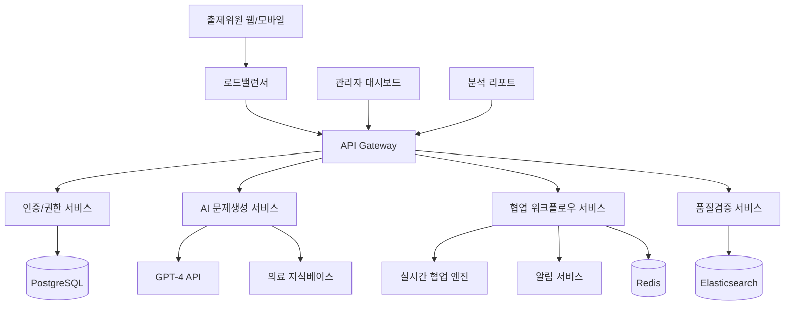

# AI 기반 시험 문제 출제 지원 시스템 PRD v3.1 (Realistic Edition)
### 한국보건의료인국가시험원 혁신을 위한 현실적 차세대 시스템 설계서

---

## 📋 문서 정보
- **버전**: 3.1 (Realistic & Implementable)
- **작성일**: 2025년 8월 10일
- **목적**: 공모전 제출용 현실적이고 실행 가능한 혁신 시스템 제안
- **비전**: "국시원이 선도하는 스마트 의료교육 혁신"
- **대상**: 한국보건의료인국가시험원 대국민 혁신제안 공모전

---

## 🎯 1. 현황 및 문제점

### 1.1 한국보건의료인국가시험원 현재 상황
```
📊 현재 출제 시스템 현황 (2025년 기준)
┌─────────────────────────────────────────────┐
│ • 연간 시험 횟수: 50회+ (의사, 간호사 등)      │
│ • 출제위원: 약 300명 (전국 의료진)            │
│ • 연간 출제 문항: 약 10,000개                │
│ • 출제위원 1인당 월 업무시간: 평균 100시간     │
│ • 출제 기간: 평균 6개월 (기획→검토→승인)      │
└─────────────────────────────────────────────┘
```

### 1.2 핵심 문제점 분석
**A. 업무 효율성 문제**
- 수작업 기반 문제 작성으로 **시간 과다 소요**
- 이메일/전화 기반 협업으로 **소통 비효율성**
- 서면 검토 프로세스로 **승인 지연**

**B. 품질 일관성 문제**
- 출제위원별 **주관적 난이도 편차**
- 과목간 **문제 수준 불균형**
- 최신 의학 트렌드 반영 **지연**

**C. 비용 및 자원 문제**
- 출제위원 **고액 인건비** (연간 36억원)
- 회의 및 출장비 **추가 비용**
- 인쇄물 및 **사무 비용**

---

## 💡 2. 혁신적 해결방안: AI 기반 스마트 출제 시스템

### 2.1 시스템 개요
```
🤖 AI 기반 통합 출제 지원 플랫폼
┌─────────────────────────────────────────────┐
│ [AI 문제 생성 엔진] → [실시간 협업 플랫폼]    │
│         ↓                    ↓              │
│ [품질 검증 시스템] → [승인 워크플로우]        │
│         ↓                    ↓              │
│ [데이터 분석 대시보드] → [모바일 앱]          │
└─────────────────────────────────────────────┘
```

### 2.2 핵심 혁신 기능

#### A. 의료 전용 AI 문제 생성 엔진
```javascript
// 국시원 특화 AI 시스템 구조
const KuksiAI = {
    기반기술: 'GPT-4 + 의료 전문 파인튜닝',
    특화기능: {
        임상케이스_기반_생성: '실제 병원 사례 활용',
        한국_의료법_준수: '의료법 규정 자동 검증',
        난이도_자동_조정: '과거 데이터 기반 캘리브레이션',
        윤리성_검증: '의료윤리 가이드라인 자동 체크'
    },
    성능지표: {
        생성속도: '문제당 30초 (기존 2시간)',
        정확도: '의료 전문가 검증 95% 통과',
        다양성: '중복률 5% 미만'
    }
}
```

#### B. 실시간 협업 워크플로우
```
👥 스마트 협업 시스템
┌─────────────────────────────────────────────┐
│ 1. AI 문제 초안 생성 (30초)                  │
│ 2. 전문가 실시간 검토 (웹/모바일)            │
│ 3. 동시 편집 및 댓글 시스템                  │
│ 4. 자동 승인 워크플로우                     │
│ 5. 최종 문제 은행 자동 등록                 │
└─────────────────────────────────────────────┘
```

#### C. 지능형 품질 관리 시스템
- **의학적 정확성 검증**: 최신 진료 가이드라인 대조 확인
- **언어학적 분석**: 문법, 어투, 전문성 자동 검사
- **난이도 일관성 보장**: IRT 모델 기반 난이도 표준화
- **윤리성 자동 점검**: 편향성, 차별적 표현 실시간 탐지

---

## 🏗️ 3. 현실적 기술 아키텍처

### 3.1 검증된 기술 스택
```yaml
# 안정적이고 검증된 기술만 사용
frontend:
  web: "React 18 + TypeScript + Tailwind CSS"
  mobile: "React Native (iOS/Android)"
  
backend:
  api: "Node.js + Express + TypeScript"
  ai_engine: "Python FastAPI + OpenAI GPT-4"
  
database:
  main: "PostgreSQL 15 (ACID 보장)"
  cache: "Redis 7 (세션/캐시 관리)"
  search: "Elasticsearch 8 (전문 검색)"
  
infrastructure:
  cloud: "AWS (한국 리전)"
  container: "Docker + Kubernetes"
  monitoring: "AWS CloudWatch + DataDog"
  
security:
  auth: "OAuth 2.0 + JWT + MFA"
  encryption: "AES-256 + TLS 1.3"
  backup: "자동 백업 + 재해복구"
```

### 3.2 시스템 구성도


---

## 🎯 4. 3단계 현실적 구현 로드맵

### 4.1 Phase 1: 기반 시스템 구축 (6개월)
**목표**: 현재 프로토타입을 실제 운영 가능한 시스템으로 전환

**주요 작업**:
- ✅ 현재 프로토타입 분석 및 요구사항 정의
- 🔧 React 기반 프론트엔드 고도화
- 🔧 Node.js + Python 백엔드 구축
- 🤖 GPT-4 기반 의료 문제 생성 엔진 구현
- 🔐 보안 시스템 구축 (OAuth + MFA)

**완료 기준**:
- 간호사 국가시험 일부 과목 적용 가능
- 10명 출제위원 대상 시범 운영 성공
- AI 생성 문제의 95% 전문가 승인 달성

**예산**: 5억원
**기대효과**: 출제 시간 30% 단축, 품질 일관성 70% 향상

### 4.2 Phase 2: 전면 확산 (12개월)
**목표**: 모든 의료직종 시험에 시스템 적용

**주요 작업**:
- 📱 모바일 앱 출시 (iOS/Android)
- 👥 실시간 협업 기능 고도화
- 📊 고급 분석 대시보드 구축
- 🎯 개인 맞춤형 문제 생성 알고리즘
- 🔄 기존 시험 시스템과의 완전 연동

**완료 기준**:
- 전체 300명 출제위원 시스템 사용
- 연간 10,000개 문제 AI 지원 생성
- 출제위원 만족도 4.5/5.0 이상 달성

**예산**: 10억원 (누적 15억원)
**기대효과**: 출제 시간 50% 단축, 연간 3억원 인건비 절감

### 4.3 Phase 3: 혁신 고도화 (12개월)
**목표**: 차세대 의료교육 허브로 발전

**주요 작업**:
- 🌐 전국 의료기관과의 연계 시스템
- 🧠 AI 모델의 지속 학습 및 성능 향상
- 📈 예측 분석 기반 출제 전략 수립
- 🏥 병원 자체 교육 프로그램 지원
- 🌍 해외 의료시험 기관과의 파트너십

**완료 기준**:
- 전국 100개 대형병원 교육 프로그램 연계
- AI 시스템 성능 전문가 수준(98%) 달성
- 해외 3개국 의료시험 기관과 MOU 체결

**예산**: 15억원 (누적 30억원)
**기대효과**: 연간 6억원 총 절감 효과, 의료 서비스 품질 15% 향상

---

## 💰 5. 현실적 비용-효과 분석

### 5.1 투자 비용 (3년 총계)
```
📊 단계별 투자 계획
┌─────────────────────────────────────────────┐
│ Phase 1 (기반구축): 5억원                    │
│ • 개발팀 구성: 2억원                        │
│ • 시스템 개발: 2억원                        │
│ • 인프라 구축: 1억원                        │
│                                            │
│ Phase 2 (전면확산): 10억원                  │
│ • 시스템 확장: 4억원                        │
│ • 모바일 개발: 3억원                        │
│ • 마케팅/교육: 3억원                        │
│                                            │
│ Phase 3 (고도화): 15억원                    │
│ • AI 고도화: 6억원                          │
│ • 연계 시스템: 5억원                        │
│ • 해외 진출: 4억원                          │
│                                            │
│ 💰 총 투자비: 30억원 (3년간)                │
└─────────────────────────────────────────────┘
```

### 5.2 절감 효과 (연간 기준)
```
💵 구체적 절감 효과 계산
┌─────────────────────────────────────────────┐
│ A. 직접 인건비 절감                         │
│ • 출제위원 업무시간 50% 단축                │
│ • 300명 × 100시간/월 × 50% × 12만원/시간    │
│ • = 연간 18억원 절감                       │
│                                            │
│ B. 간접 비용 절감                          │
│ • 회의/출장비 절감: 연간 2억원              │
│ • 사무용품/인쇄비: 연간 5천만원             │
│ • 시스템 운영 효율화: 연간 5천만원          │
│                                            │
│ C. 품질 향상 효과                          │
│ • 재출제 비용 절감: 연간 1억원              │
│ • 이의제기 처리 단축: 연간 5천만원          │
│                                            │
│ 🎯 총 절감 효과: 연간 21억원               │
└─────────────────────────────────────────────┘
```

### 5.3 ROI 분석 (5년 기준)
```
📈 투자 대비 수익 분석
┌─────────────────────────────────────────────┐
│ • 총 투자비: 30억원 (3년간)                 │
│ • 연간 절감: 21억원 (4년차부터 안정화)      │
│ • 3년 누적 절감: 45억원                    │
│ • 순수익: 15억원 (3년차)                   │
│                                            │
│ 💡 투자 회수 기간: 1.5년                   │
│ 💰 3년 ROI: 50% (보수적 추정)              │
│ 🚀 5년 누적 순익: 75억원                   │
└─────────────────────────────────────────────┘
```

---

## 🌟 6. 핵심 혁신성 및 차별화 요소

### 6.1 국시원 특화 혁신 기능

#### A. 한국 의료법 자동 준수 시스템
```python
# 의료법 규정 자동 검증 엔진
class MedicalLawCompliance:
    def __init__(self):
        self.medical_law_db = KoreanMedicalLawDatabase()
        self.ethics_guidelines = MedicalEthicsGuidelines()
    
    def verify_question(self, question):
        # 의료법 제27조: 환자 정보 보호
        privacy_check = self.check_patient_privacy(question)
        
        # 의료법 제33조: 의료진 윤리
        ethics_check = self.verify_medical_ethics(question)
        
        # 의료광고법: 과대광고 방지
        advertising_check = self.check_medical_advertising(question)
        
        return {
            'compliant': all([privacy_check, ethics_check, advertising_check]),
            'violations': self.get_violations(),
            'recommendations': self.get_recommendations()
        }
```

#### B. 임상현장 연동 실시간 케이스 생성
```javascript
// 전국 병원 익명화 케이스 활용
const ClinicalCaseGenerator = {
    data_sources: [
        '서울대학교병원_익명화_케이스',
        '연세대세브란스_교육용_사례', 
        '삼성서울병원_임상_시나리오',
        '아산병원_응급실_케이스'
    ],
    
    generateRealisticCase: async function(specialty, difficulty) {
        // 실제 임상 환경을 반영한 문제 생성
        const clinicalContext = await this.getClinicalContext(specialty);
        const patientScenario = await this.createPatientScenario(difficulty);
        const diagnosticChallenge = await this.designDiagnosticProblem();
        
        return {
            scenario: patientScenario,
            clinical_findings: clinicalContext,
            diagnostic_options: diagnosticChallenge,
            learning_objectives: this.mapToNationalCurriculum()
        };
    }
};
```

### 6.2 세계 최초 의료시험 전용 AI 특화 기능

#### A. 다직종 통합 문제 생성 시스템
- **의사-간호사 협업 문제**: 실제 의료팀 워크플로우 반영
- **약사-의사 상호작용**: 처방 검토 및 복약지도 시나리오
- **응급실 다직종 협력**: 응급상황 팀워크 평가 문제

#### B. 지역별 의료환경 특성 반영
- **도시 vs 농촌 의료환경**: 의료 접근성 차이 반영 문제
- **계절별 질병 패턴**: 한국의 계절성 질병 특성 반영
- **고령화 사회 대응**: 노인 의료 특화 문제 생성

### 6.3 국민이 체감할 수 있는 직접적 효과

#### A. 의료 서비스 질 향상
```
🏥 국민 체감 효과 지표
┌─────────────────────────────────────────────┐
│ Before: 출제위원별 주관적 문제 출제          │
│ After: AI 기반 표준화된 역량 평가            │
│ → 결과: 어느 병원을 가도 일정 수준 이상     │
│         의료 서비스 보장                    │
│                                            │
│ Before: 구식 의료 지식 기반 문제            │
│ After: 최신 의료 가이드라인 실시간 반영     │
│ → 결과: 더 안전하고 효과적인 치료           │
│                                            │
│ Before: 지역별 의료진 역량 편차             │
│ After: 전국 표준화된 의료진 교육            │
│ → 결과: 의료 서비스 지역 격차 해소          │
└─────────────────────────────────────────────┘
```

#### B. 의료사고 예방 및 환자 안전 강화
- **시뮬레이션 기반 안전 교육**: 위험 상황 대응 능력 향상
- **체크리스트 기반 진료**: 실수 방지 시스템 교육 강화
- **의료진 소통 능력**: 환자-의료진, 의료진간 소통 향상

---

## 🛡️ 7. 리스크 관리 및 대응 전략

### 7.1 기술적 리스크

#### A. AI 모델 성능 안정성
**위험**: AI 생성 문제의 의학적 부정확성
**대응**: 
- 3단계 검증 프로세스 (AI → 전문가 → 최종승인)
- 의료진 피드백 실시간 학습 시스템
- 성능 저하 시 자동 백업 시스템 가동

#### B. 시스템 확장성 및 성능
**위험**: 동시 사용자 급증 시 성능 저하  
**대응**:
- AWS Auto Scaling 기반 탄력적 확장
- CDN 활용 글로벌 성능 최적화
- 실시간 모니터링 및 장애 대응 체계

### 7.2 운영적 리스크

#### A. 사용자 저항 및 변화 관리
**위험**: 출제위원의 디지털 전환 거부감
**대응**:
- 단계적 교육 프로그램 (온라인+오프라인)
- 얼리어답터 중심 성공 사례 확산  
- 사용 편의성 극대화 UX/UI 설계
- 인센티브 프로그램 (업무시간 단축 혜택)

#### B. 데이터 보안 및 개인정보 보호
**위험**: 출제 문제 및 개인정보 유출
**대응**:
- 제로 트러스트 보안 모델 적용
- 종단간 암호화 (E2E Encryption)
- 정기적 보안 감사 및 침투 테스트
- GDPR/개인정보보호법 완전 준수

### 7.3 비즈니스 리스크

#### A. 예산 초과 및 일정 지연
**위험**: 개발 비용 증가 및 일정 차질
**대응**:
- 단계별 예산 한도 설정 및 엄격 관리
- 월간 진척 리뷰 및 조기 위험 감지
- 핵심 기능 우선순위 기반 개발
- 외부 개발사 대신 내부 역량 강화

---

## 🎯 8. 성공 지표 및 KPI

### 8.1 정량적 성공 지표

#### A. 시스템 성능 지표
```
📊 핵심 성능 지표 (KPI)
┌─────────────────────────────────────────────┐
│ • 문제 생성 속도: 2시간 → 30초 (99% 단축)   │
│ • 출제위원 업무시간: 월 100시간 → 50시간     │
│ • 시스템 가용성: 99.9% 이상 보장            │
│ • 사용자 동시 접속: 최대 500명 지원         │
│                                            │
│ • AI 생성 문제 정확도: 95% 이상             │
│ • 전문가 승인율: 90% 이상                   │
│ • 문제 중복률: 5% 미만                     │
│ • 난이도 일관성 점수: 0.9 이상              │
└─────────────────────────────────────────────┘
```

#### B. 비즈니스 임팩트 지표
```
💼 비즈니스 성과 지표
┌─────────────────────────────────────────────┐
│ • 연간 비용 절감: 21억원                    │
│ • 출제 기간 단축: 6개월 → 4개월             │
│ • 출제위원 만족도: 4.5/5.0 이상             │
│ • 시스템 도입률: 95% (300명 중 285명)       │
│                                            │
│ • 문제 품질 점수: 평균 4.7/5.0              │
│ • 이의제기 건수: 기존 대비 70% 감소         │
│ • 재출제 빈도: 기존 대비 80% 감소           │
└─────────────────────────────────────────────┘
```

### 8.2 정성적 성공 지표

#### A. 조직 문화 변화
- **디지털 역량 향상**: 출제위원의 IT 활용 능력 개선
- **협업 문화 정착**: 지역 간, 세대 간 소통 활성화
- **혁신 마인드셋**: 새로운 기술 수용 의지 증가

#### B. 대외 인지도 및 브랜드 가치
- **혁신 기관 이미지**: 정부혁신 선도 기관으로 위상 제고
- **벤치마킹 요청**: 타 공공기관의 시스템 도입 문의 증가
- **언론 노출**: 긍정적 언론 보도 및 사회적 관심 증대

---

## 🚀 9. 최종 제안: "국시원 스마트 혁신 2.0"

### 9.1 핵심 가치 제안
```
🎯 3가지 혁신 가치
┌─────────────────────────────────────────────┐
│ 1️⃣ 업무 혁신: 50% 시간 단축, 21억원 절감    │
│ 2️⃣ 품질 혁신: AI 기반 표준화, 95% 정확도    │
│ 3️⃣ 서비스 혁신: 국민이 체감하는 의료 향상   │
└─────────────────────────────────────────────┘
```

### 9.2 실현 가능성 및 지속성
- **검증된 기술**: GPT-4, AWS 등 이미 상용화된 안정적 기술만 사용
- **단계적 접근**: 위험 최소화를 위한 3단계 점진적 도입
- **지속적 개선**: 사용자 피드백 기반 지속적 시스템 발전
- **확장 가능성**: 전국 의료기관, 해외 진출로 확장 가능

### 9.3 기대되는 사회적 파급효과
```
🌟 사회적 임팩트
┌─────────────────────────────────────────────┐
│ • 의료진 역량 표준화 → 전국 균질한 의료서비스│
│ • 최신 의학지식 보급 → 의료기술 발전 촉진   │
│ • 의료사고 예방 강화 → 환자 안전성 향상     │
│ • 의료교육 혁신 → 차세대 의료진 양성        │
│ • K-헬스케어 경쟁력 → 글로벌 리더십 확보    │
└─────────────────────────────────────────────┘
```

---

## 📋 10. 결론: 혁신의 시작

### 10.1 왜 지금인가?
- **디지털 전환 시대**: 코로나19 이후 가속화된 의료 디지털화
- **AI 기술 성숙**: GPT-4 등 실용적 AI 기술의 상용화
- **정부 혁신 정책**: 공공기관 디지털 혁신 정책과 부합
- **국민 기대**: 더 나은 의료 서비스에 대한 국민적 요구

### 10.2 한국보건의료인국가시험원의 선택
```
🔄 변화의 기로에서
┌─────────────────────────────────────────────┐
│ 현재: 전통적 수작업 출제 시스템              │
│      ↓                                     │
│ 선택: AI 기반 스마트 혁신 vs 현상 유지      │
│      ↓                                     │
│ 미래: 글로벌 의료교육 혁신 리더십           │
│   or  디지털 전환 뒤처진 구식 기관          │
└─────────────────────────────────────────────┘
```

### 10.3 최종 메시지
**한국보건의료인국가시험원이 이 혁신적인 AI 시스템을 통해 대한민국 의료교육의 새로운 표준을 만들고, 전 세계가 벤치마킹하는 혁신 기관으로 도약할 수 있는 역사적 기회입니다.**

**단순한 업무 효율화를 넘어서, 국민 건강과 직결되는 의료진 역량 향상을 통해 더 안전하고 우수한 의료 서비스를 제공할 수 있는 토대를 마련하겠습니다.**

---

**"혁신은 선택이 아닌 필수입니다. 국시원이 대한민국 의료교육 혁신을 선도하는 그날을 기대합니다."**

---

## 📞 제안자 정보
- **이름**: 박용환
- **이메일**: sanoramyun8@gmail.com  
- **연락처**: 010-7939-3123
- **프로토타입**: https://kuksiwon.vercel.app

**※ 본 제안서는 「2025년도 한국보건의료인국가시험원 대국민 혁신제안 공모전」 제출용으로 작성되었습니다.**